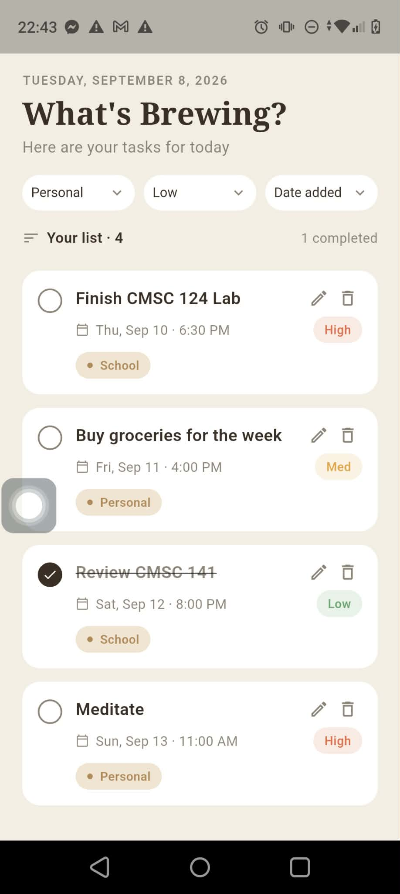
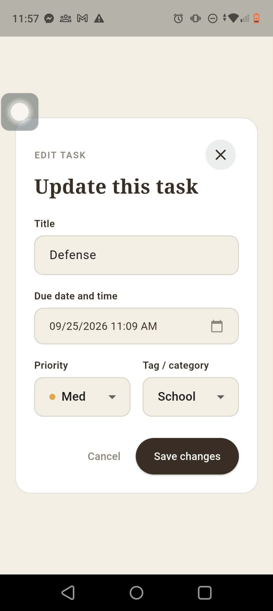
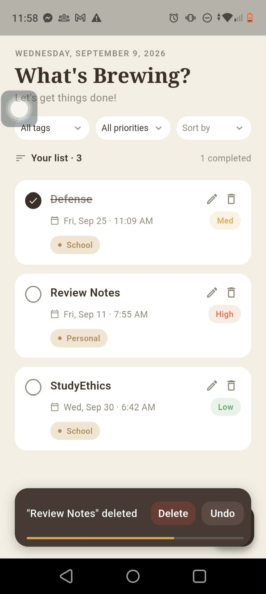

# To-Do List App

A Flutter CRUD application for creating, organizing, completing, editing, and
deleting tasks. Tasks update in real time for every connected app instance.

## Tech Stack

- **Frontend:** Flutter and Dart
- **State management:** Provider with `ChangeNotifier`
- **Backend and database:** Firebase Cloud Firestore
- **Firebase integration:** `firebase_core` and `cloud_firestore`
- **Supporting packages:** `intl` for date formatting and `uuid` for task IDs

### Why Flutter and Firestore?

Flutter provides one codebase for Android and web, which fits a small CRUD
application and keeps the UI consistent across platforms. Firestore was chosen
as the backend database because it provides a document-based data model,
real-time listeners, and a Flutter SDK without requiring a separate server or
REST API. The app listens to the `tasks` collection, so changes made by one
client appear automatically in other connected clients.

## Prerequisites

- Flutter SDK with Dart 3.13.2 or a compatible newer Dart 3 release
- A configured Android emulator/device or a supported Flutter web browser
- Access to the Firebase project configured in `lib/firebase_options.dart`

The repository already contains the generated Firebase configuration for the
Android and web platforms. Firestore must be enabled in the configured Firebase
project before running the app.

## Run Locally

1. Clone or download the repository and open its root directory:

	```bash
	cd todo_list_app
	```

2. Verify that Flutter is installed and that a target device is available:

	```bash
	flutter doctor
	flutter devices
	```

3. Install Dart and Flutter dependencies:

	```bash
	flutter pub get
	```

4. Start the app on the selected device or browser:

	```bash
	flutter run
	```

	To run specifically in a browser, use `flutter run -d chrome` when Chrome
	is listed by `flutter devices`. To run on a particular device, use
	`flutter run -d <device-id>`.

5. Run the automated widget tests:

	```bash
	flutter test
	```

## Firestore Data Model

Tasks are stored in the `tasks` collection. Each document contains:

| Field | Type | Description |
| --- | --- | --- |
| `id` | string | Task document ID and application task ID |
| `title` | string | Task title |
| `dueDateTime` | timestamp | Task due date and time |
| `createdAt` | timestamp | Time the task was created |
| `priority` | string | `low`, `medium`, or `high` |
| `tag` | string | `school`, `personal`, or `others` |
| `isDone` | boolean | Whether the task is complete |

## CRUD Data Operations

The app does not expose HTTP REST routes. CRUD operations are implemented with
the Firestore Dart SDK in `lib/services/task_service.dart`.

### Read tasks in real time

```dart
FirebaseFirestore.instance
	 .collection('tasks')
	 .orderBy('createdAt', descending: true)
	 .snapshots();
```

`TaskProvider` subscribes to this stream and converts each document into a
`Task` model. The UI is rebuilt whenever the collection changes.

### Create a task

```dart
await FirebaseFirestore.instance
	 .collection('tasks')
	 .doc(task.id)
	 .set(task.toMap(), SetOptions(merge: true));
```

### Update a task

```dart
await FirebaseFirestore.instance
	 .collection('tasks')
	 .doc(task.id)
	 .set(task.toMap(), SetOptions(merge: true));
```

The same operation updates a task title, due date, priority, tag, or
completion status. Tapping a task's completion control creates a copied task
with the opposite `isDone` value.

### Delete a task

```dart
await FirebaseFirestore.instance
	 .collection('tasks')
	 .doc(taskId)
	 .delete();
```

The UI provides a four-second undo window. Choosing **Undo** writes the saved
task document back to Firestore; choosing permanent delete removes it
immediately.

## Project Structure

```text
lib/
├── models/       Task data model
├── providers/    App state and Firestore stream subscription
├── screens/      Task list and task form screens
├── services/     Firestore CRUD operations
├── utils/        Shared constants and enums
└── widgets/      Reusable UI components
```

## Firestore Rules

The current development rules allow reads and writes to documents in the
`tasks` collection. Before deploying this app beyond a classroom or local
development environment, add authentication and restrict access to authorized
users.

## App Screenshots



