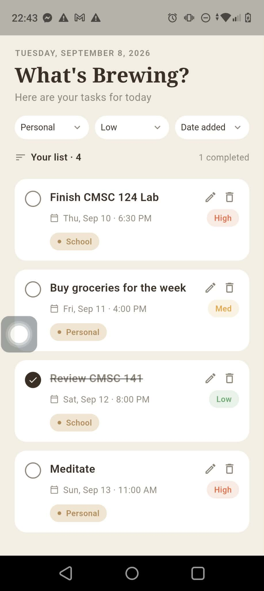
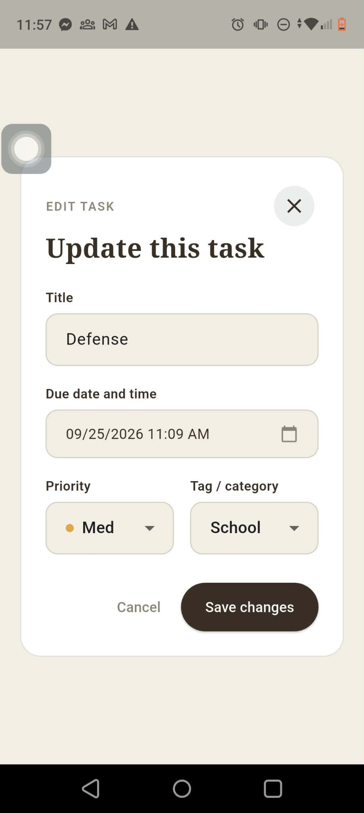
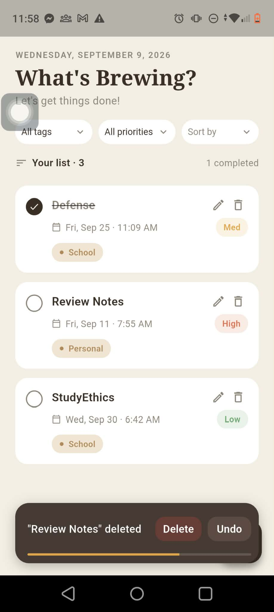

# To-Do List App

A Flutter task-management app with Firebase email/password accounts. Users can
register with a display name and unique username, sign in with either username
or email, manage their profile, and create, organize, complete, edit, and delete
tasks. Task changes are streamed from Cloud Firestore in real time.

## Features

- Create an account with display name, username, email, and password.
- Sign in with username or email and password; sign out from the task list or
	account settings.
- Request a password reset by username or email.
- Update display name and username; change email or password after confirming
	the current password. Email changes require verification.
- Create and edit tasks with a due date and time, priority, and tag; mark tasks
	complete or incomplete.
- Filter by tag and priority, sort by due date, priority, tag, or date added,
	and see task/completion counts.
- Delete with a four-second undo window, or confirm permanent deletion.
- Receive live task-list updates through Firestore snapshots.

## Technology

- **Frontend:** Flutter and Dart; targets Android and web.
- **State management:** Provider with `ChangeNotifier`.
- **Backend services:** Firebase Authentication handles accounts and
	credentials; the app uses Firebase's client SDKs directly, with no separate
	application server or HTTP REST API.
- **Database:** Cloud Firestore stores task documents and username mappings.
- **Authentication approach:** Firebase Authentication email/password
	provider. Usernames are normalized to lowercase and mapped to a Firebase
	Auth UID and email in Firestore so users can use a username to sign in or
	request a password reset.
- **Other packages:** `intl` for date formatting and `uuid` for task IDs.

## Prerequisites

- Flutter SDK and the Dart SDK version allowed by `pubspec.yaml` (`^3.13.2`).
- Android Studio/emulator or a connected Android device for Android runs, or a
	supported browser (such as Chrome) for web runs.
- Access to the Firebase project configured in `lib/firebase_options.dart`.

The repository includes generated Firebase configuration for Android and web.
The Firebase project must have Email/Password sign-in enabled and a Cloud
Firestore database created before the app can use authentication and data
features.

## Installation and Local Run

From the repository root:

```bash
flutter doctor
flutter devices
flutter pub get
flutter run
```

Use `flutter run -d chrome` to run in Chrome, or replace `chrome` with a device
ID shown by `flutter devices`. Run the widget tests with:

```bash
flutter test
```

## Firebase Setup

1. Open the Firebase project referenced by `lib/firebase_options.dart` and
	 `android/app/google-services.json`.
2. In **Authentication > Sign-in method**, enable **Email/Password**.
3. Create the default Cloud Firestore database. The configured database
	 location is `asia-southeast1`.
4. Deploy the checked-in Firestore rules from the repository root using the
	 Firebase CLI, authenticated and targeting the configured project:

	 ```bash
	 firebase deploy --project cmsc-128-labs --only firestore:rules
	 ```

No SQL schema migration or seed command is required. Firestore creates the
`tasks` and `usernames` collections as the app writes the first task or creates
the first account. Firebase Hosting is not configured by this repository; run
the web target locally with Flutter as described above.

## Authentication and Session Behavior

`AuthService` wraps Firebase Authentication. Registration creates an
email/password account, sets the Firebase display name, and transactionally
creates a Firestore document at `usernames/{normalizedUsername}` containing the
account UID and email. Usernames must be 3-20 lowercase letters, digits, or
underscores after normalization. If username setup fails during registration,
the newly created Auth account is deleted as cleanup.

For sign-in, an identifier containing `@` is treated as an email. Otherwise the
app looks up `usernames/{username}` and uses its email to call Firebase
Authentication. The Firebase Auth SDK maintains the signed-in session across
app launches; `AuthGate` listens to `authStateChanges()` and displays the
authenticated app or sign-in screen as the session changes. Signing out clears
that Firebase session.

Password recovery accepts the same username-or-email identifier. Usernames are
resolved to their email address, then Firebase Authentication sends its
password-reset email. The app displays a generic confirmation when the user is
not found to avoid revealing whether an account exists. The user completes the
reset through the link sent by Firebase and then signs in with the new password.

## Firestore Data and Operations

There is no custom REST API. The equivalent data/authentication operations are
made through the Firebase Dart SDK in `lib/services/`.

Tasks are stored in `tasks/{taskId}` with these fields:

| Field | Type | Description |
| --- | --- | --- |
| `id` | string | Task document ID and application task ID |
| `title` | string | Task title |
| `dueDateTime` | timestamp | Task due date and time |
| `createdAt` | timestamp | Task creation time |
| `priority` | string | `low`, `medium`, or `high` |
| `tag` | string | `school`, `personal`, or `others` |
| `isDone` | boolean | Whether the task is complete |

Username mappings are stored at `usernames/{username}` with `uid` and `email`
fields. Representative operations used by the app:

```dart
// Listen to tasks ordered newest first.
FirebaseFirestore.instance
		.collection('tasks')
		.orderBy('createdAt', descending: true)
		.snapshots();

// Create or update a task document.
await FirebaseFirestore.instance
		.collection('tasks')
		.doc(task.id)
		.set(task.toMap(), SetOptions(merge: true));

// Delete a task document.
await FirebaseFirestore.instance.collection('tasks').doc(taskId).delete();

// Create an account or sign in through Firebase Authentication.
await FirebaseAuth.instance.createUserWithEmailAndPassword(
	email: email,
	password: password,
);
await FirebaseAuth.instance.signInWithEmailAndPassword(
	email: email,
	password: password,
);

// Send a password-reset email (the app resolves a username to email first).
await FirebaseAuth.instance.sendPasswordResetEmail(email: email);
```

`TaskProvider` applies filters and sorting locally to the Firestore task stream.
When a user requests deletion, the app waits four seconds before deleting from
Firestore; Undo restores the saved document during that interval.

## Security Note

The checked-in rules in `firestore.rules` currently allow anyone to read and
write the `tasks` collection (`allow read, write: if true`). Task documents are
also not associated with a user, so accounts do not currently have isolated
task lists. The username collection allows public document lookups to support
username-based sign-in and restricts writes to the authenticated account owner.
These rules and the global task collection are suitable only for the current
classroom/demo setup. Before production use, scope each task to an owner and
update the rules to require that authenticated owner for every read and write.

## Project Structure

```text
lib/
├── models/       Task data model
├── providers/    Task state, filtering, sorting, and Firestore subscription
├── screens/      Authentication, profile, recovery, and task screens
├── services/     Firebase Authentication and Firestore operations
├── utils/        Shared constants and error translation
└── widgets/      Reusable UI components
```

## Screenshots

<p float="left">
	
	
	
</p>
